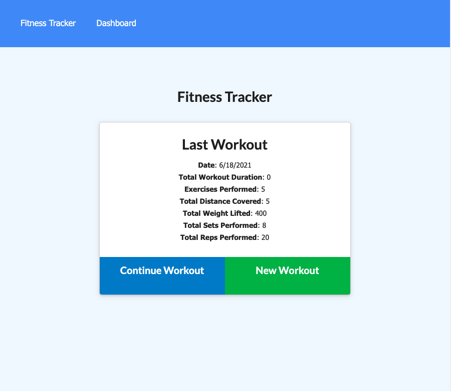
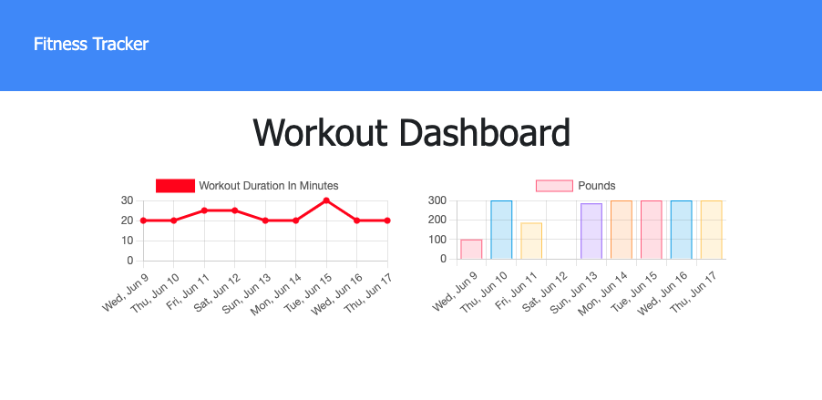

# Workout Tracker

## Description

This app allows you to view create and track daily workouts. Log multiple exercises in a workout on a given day and track the name, type, weight, sets, reps, and duration of exercise. If the exercise is a cardio exercise, it will track the distance traveled.

## Built With

* [node.js](https://nodejs.org/en/)

* [express](https://expressjs.com/)

* [mongodb](https://www.mongodb.com/)

* [mongoose](https://mongoosejs.com/)

* [Morgan](https://www.npmjs.com/package/morgan)

* [sequelize](https://sequelize.org/)

* [javascript](https://developer.mozilla.org/en-US/docs/Web/javascript)

## Contributers

William Farnsworth - [Github](https://github.com/Cynwise)
